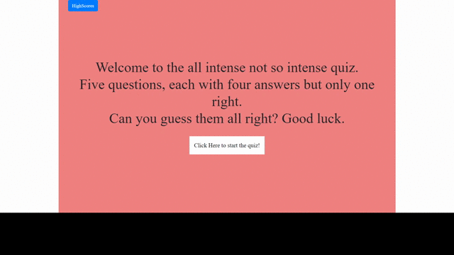

# Web-APIs

This application is a quiz game that has been precoded and the user just clicks on the start button to start the quiz. Once the quiz is started they are prompted with a question with four answers. Their score which goes up by one if they get it right. If they were to get it wrong, they lose 15 seconds. If the user runs out of time they are forced to the end game screen asking them if they would want to try again and save their scores.

# Credits
This was one of the harder projects that I have done just because it required a lot of minor coding here and there. There are some bugs that still need to be fixed.
<ul>
  <li> Jason Heap (TA)
    
 Jason helped me with the checking of the buttons. If the user clicks on an answer it would check the value of the button to the answer to see if it was right. He showed me that it was targeting the wrong value and that all I had to do was just put a class into the buttons so it would work. 
   <li> Matthew (Online TA)
     
 Matt helped me with the beginning of the project because I felt lost on this one. He helped me get the ball rolling with what I needed to code and what tasks are needed to be done.
  <li> W3School.com
  <li> Jquery.com
    
# Usage
Free to use but there are bunch of bugs that needs to be squished
